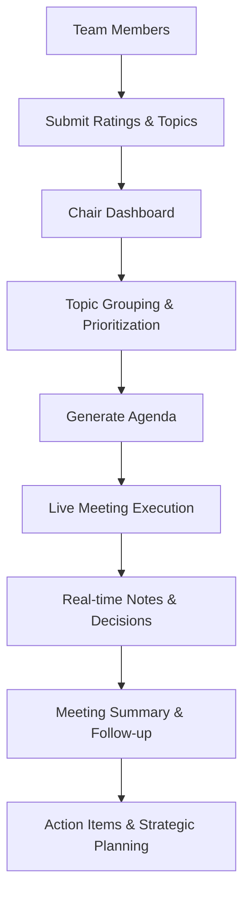

# Strategic Team Check-in System

> A comprehensive meeting management platform designed for scientific research teams to transform chaotic check-ins into structured, productive discussions with clear outcomes and accountability.

## 🎯 Purpose & Intent

This system was designed specifically for fisheries research teams conducting **scientific research and stewardship of Anthropic fisheries**. However, it's adaptable to any organization managing strategic objectives across multiple operational levels.

### Core Problems Solved:
- **Meeting Chaos** → Structured agenda generation with intelligent prioritization
- **Silent Voices** → Ensures every team member provides input, even "don't know enough" responses
- **Knowledge Gaps** → Identifies areas where team members lack expertise for targeted training
- **Time Waste** → Smart time allocation with real-time tracking and flexible adjustments
- **Lost Context** → Comprehensive note-taking and automatic meeting summaries
- **Strategic Drift** → Visual pyramid tracking keeps focus on critical objectives

## 📊 Strategic Framework: The Priority Pyramid

The system organizes work across three hierarchical levels:

```
    🔵 CRITICAL - Major Projects & Events
         (Large-scale initiatives, critical deadlines)
    
      🔵 IMPORTANT - Key Milestones  
        (Deliverables, publications, major deadlines)
    
    🔵 FOUNDATIONAL - Operations & Support
      (Daily operations, procurement, QC, training, safety)
```

### Rating Philosophy
- **0-10 Scale** where 0 = Crisis/Disaster, 10 = On Track/Success
- **Knowledge Gaps** captured via "Don't Know Enough" option
- **Visual Indicators**: Green (rated), Orange (don't know), Gray (unrated)

## 🚀 Key Features

### 👥 Participant Experience
- **Individual Goal Rating** - Click to expand, rate progress, add notes
- **Knowledge Gap Capture** - "Don't Know Enough" checkbox prevents uninformed ratings
- **Team Shoutouts** - Celebrate wins and recognize contributions
- **Discussion Topics** - Submit items with time estimates and urgency flags
- **Real-time Validation** - Visual feedback shows completion status

### 📊 Chair Dashboard
- **Participation Analytics** - Response rates, engagement metrics, knowledge gaps
- **Intelligent Topic Grouping** - Merge similar submissions ("Q2 Budget" + "Equipment Budget")
- **Priority Visualization** - Sophisticated pyramid with completion indicators
- **Low Score Alerts** - Automatic flagging of items scoring ≤4
- **Emergency Detection** - Urgent items automatically prioritized

### ⏱️ Live Meeting Management
- **Smart Agenda Generation** - Auto-prioritizes: Emergency → Low Scores → Grouped Topics
- **Dual Timer System** - Meeting countdown + current item timer
- **Flexible Time Control** - Add 30s/1min, pause/resume, extend discussions
- **Real-time Note Taking** - Individual notes per agenda item
- **Progress Tracking** - Visual completion indicators and time management

### 📧 Automated Documentation
- **Meeting Summaries** - Auto-generates email-ready reports
- **Decision Tracking** - Captures outcomes and action items
- **Follow-up Management** - Strategic items moved to future meetings
- **Knowledge Gap Reports** - Team training needs analysis

## 🔄 Information Flow



### Pre-Meeting Phase
1. **Team Input Collection** - Strategic ratings, discussion topics, shoutouts
2. **Data Processing** - Dashboard aggregates, groups similar topics, identifies priorities
3. **Agenda Generation** - Smart prioritization: Emergency → Low Scores → Grouped Items
4. **Knowledge Gap Analysis** - Identifies training needs and expertise distribution

### Meeting Execution Phase
1. **Structured Discussion** - Follow generated agenda with time management
2. **Real-time Documentation** - Notes captured per item with timestamps
3. **Progress Tracking** - Visual indicators for completion and time usage
4. **Flexible Navigation** - Skip, extend, or re-prioritize items as needed

### Post-Meeting Phase
1. **Automatic Summary** - Email-ready report with notes and decisions
2. **Action Item Extraction** - Clear follow-up tasks and ownership
3. **Strategic Item Planning** - Long discussions moved to dedicated sessions
4. **Team Health Tracking** - Trend analysis for organizational insights

## 🎨 User Experience Design

### Visual Hierarchy
- **Blue Gradient Theme** - Light to dark blue representing foundational to critical
- **Status Indicators** - Colored dots show completion/knowledge states
- **Interactive Elements** - Smooth animations and responsive feedback
- **Accessibility** - Clear typography, sufficient contrast, keyboard navigation

### Intuitive Interactions
- **Click to Expand** - Goal items reveal rating controls on selection
- **Visual Feedback** - Immediate color changes and status updates
- **Smart Defaults** - Reasonable starting points with easy customization
- **Error Prevention** - Clear validation and confirmation dialogs

## 🔧 Technical Architecture

### Frontend Components
- **Participant Interface** (`participant.html`) - Individual input collection
- **Chair Dashboard** (`dashboard.html`) - Data processing and visualization
- **Live Agenda** (`agenda.html`) - Real-time meeting management

### Backend Integration Points
- **FastAPI Foundation** - Scalable Python backend for data processing
- **Real-time Updates** - WebSocket connections for live collaboration
- **Data Storage** - Meeting data, user preferences, historical trends
- **Export Capabilities** - PDF reports, CSV data, email integration

### Security & Privacy
- **Local Network Option** - Can run entirely on local infrastructure
- **User Authentication** - Secure access control and session management
- **Data Encryption** - Sensitive meeting content protection
- **Audit Trails** - Complete history of changes and decisions

## 📈 Success Metrics

### Meeting Efficiency
- **Time Savings** - Reduced meeting duration with maintained coverage
- **Participation Rate** - Percentage of team providing input
- **Decision Velocity** - Time from issue identification to resolution
- **Follow-through Rate** - Action item completion tracking

### Team Health Indicators
- **Knowledge Distribution** - Expertise mapping across strategic areas
- **Engagement Levels** - Quality and quantity of contributions
- **Strategic Alignment** - Consensus on priority rankings
- **Communication Quality** - Shoutouts and positive recognition frequency

### Organizational Impact
- **Strategic Progress** - Objective completion rates and timeline adherence
- **Risk Identification** - Early warning system for struggling initiatives
- **Resource Optimization** - Better allocation based on data-driven insights
- **Team Development** - Targeted training based on knowledge gap analysis

## 🚀 Getting Started

### Quick Setup
1. **Deploy Backend** - Run FastAPI server with provided configuration
2. **Access Participant Interface** - Team members complete strategic ratings
3. **Review Dashboard** - Chair processes submissions and groups topics
4. **Generate Agenda** - Create prioritized meeting structure
5. **Execute Meeting** - Use live interface with timers and note-taking
6. **Generate Summary** - Automatic documentation and follow-up planning

### Customization Options
- **Pyramid Structure** - Modify strategic levels and categories
- **Time Allocations** - Adjust meeting duration and item time limits
- **Rating Scales** - Customize scoring systems and criteria
- **Notification Preferences** - Email templates and frequency settings

## 🔮 Future Enhancements

### Advanced Analytics
- **Trend Analysis** - Historical strategic health tracking
- **Predictive Insights** - Early warning systems for project risks
- **Comparative Benchmarking** - Team performance metrics
- **AI-Powered Recommendations** - Smart agenda optimization

### Integration Capabilities
- **Calendar Systems** - Automatic scheduling and reminders
- **Project Management** - Sync with existing workflow tools
- **Communication Platforms** - Slack/Teams integration
- **Document Management** - SharePoint/Drive connectivity

### Enhanced Collaboration
- **Remote Participation** - Video integration and virtual engagement
- **Async Input** - Time-zone friendly contribution methods
- **Mobile Optimization** - Native app development
- **Multilingual Support** - International team accommodation

---

## 📄 License & Contributing

This project is designed to improve team communication and strategic alignment in research organizations. Contributions welcome for feature enhancements, bug fixes, and documentation improvements.

**Built for teams who value structured communication, data-driven decisions, and inclusive participation.**